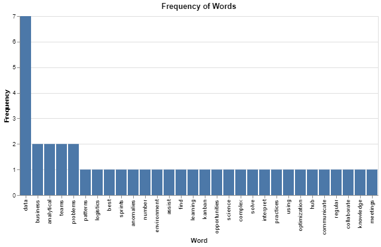
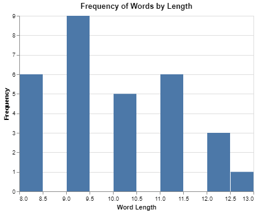

# coRPysprofiling 

 [](https://codecov.io/gh/UBC-MDS/coRPysprofiling) [](https://github.com/UBC-MDS/coRPysprofiling/actions/workflows/deploy.yml) [](https://corpysprofiling.readthedocs.io/en/latest/?badge=latest)

Package  for EDA and EDV on text

## Summary

coRPysprofiling is an open-source library designed to bring exploratory data analysis and visualization to the domain of natural language processing. Functions in the package will be used to provide some elementary statistics and visualizations for a single text corpus or provide functions to compare multiple corpora with each other.

## Installation

```bash
$ pip install -i https://test.pypi.org/simple/ corpysprofiling
```

## Features

Some specific functions include:

- `corpus_analysis`: `corpus analysis` will generate a statistical report about the characteristics of a single corpus (e.g. unique word count, average word/sentence length, top words used, topic analysis).
- `corpus_viz`: `corpus_viz` will generate relevant visualizations of a single corpus (e.g. word cloud, histograms for average word/sentence length, top words used).
- `corpora_compare`: Given two or more corpora, `corpora_compare` will find similarity (e.g, Euclidean distance or cosine similarity) between each pair of corpora.
- `corpora_best_match`: Given a reference document and two or more corpora, `corpora_best_match` will rank the corpora in the order of most relevance to the reference document.

## Relevance to the Python Ecosystem

To our knowledge, while [`wordcloud`](https://pypi.org/project/wordcloud/) library generates wordcloud visualization for a given corpus, there is no general-purpose library for exploratory analysis and visualization of a text corpus in the Python ecosystem. There are several advanced libraries for comparing similarities between different corpora: most notably, [`gensim`](https://pypi.org/project/gensim/) provides similarity comparison between large corpora using word embeddings. We believe that coRPysprofiling will provide some useful functionality for exploratory analysis and visualization and help bridge the gap between elementary text analysis to more sophisticated approaches utilizing word embeddings.

## Dependencies
- python = "^3.8"
- pandas = "^1.2.3"
- nltk = "^3.5"
- sentence-transformers = "^0.4.1"
- numpy = "^1.20.1"
- matplotlib = "^3.3.4"
- wordcloud = "^1.8.1"
- altair = "^4.1.0"
## Usage

The coRPysprofiling package can help you do some preliminary EDA and EDV on text data.  As well as comparing corpora to determine similarity.

```python
import corpysprofiling
```

Lets start with some input text.  We are going to look at a data science job description to begin with.
```python
data_science_job = "Apply statistical and machine learning knowledge to specific business problems and data. Develop initiatives to assist Engineering, Logistics, and Mechanical teams in a number of highly technical areas. Use data science techniques to find data patterns, anomalies, and optimization opportunities. Interpret, translate, and communicate analytical findings to business stakeholders. Tackle and solve complex analytical problems using quantitative approaches. Collaborate to implement data best practices through the Data Lab, Data Hub, and Data Lake teams. Work in an agile environment including regular meetings, sprints, Kanban, etc."
```

We can use the corpus_analysis function to calculate some high level statistics on this text.  This will return a dataframe with the total number of words, total number of tokens, number of unique tokens, average token length, the number of sentences and the average number of tokens in all sentences.
```python
corpus_analysis(data_science_job)
```


We can also the corpus_viz function to generate three visualization of this corpus.  To access the individual visualizations, index the visualization object by plot name.
```python
visuals = corpus_viz(data_science_job)
visuals["word cloud"]
```


```python
visuals["word freq bar chart"]
```


```python
visuals["word length bar chart"]
```


Now lets use the corpora_compare function to determine the similarity of two corpora, using the default metric `cosine_similarity`.  We will load another data science job description.
```python
data_science_job2 = "You have spent countless hours over the years solving hard problems in mathematics, statistics and computer science. You thrive on extracting useful information from large messy data sets. You know that a data set that satisfies all the requirements of a specific statistical procedure is a rarity indeed – and you know what to do about it. You have followed your passion for all things quantitative and are turning it into your profession. At ThinkingCapital we encourage everyone to trust themselves, stop holding back and use your acquired knowledge to influence your future. Everyone in the team is an integral contributor to our products, working with our customers to collaborate and design the best solutions. Our open work culture provides the opportunity for you to contribute to all aspects of our business: customer engagement, product ownership, software, QA, devops and 24/7 cloud service deployment. As a key member of our team your passion for data will help us design, develop and deploy our integrated cloud services that help small businesses succeed." 

corpora_compare(data_science_job, data_science_job2)
```

```python
> 0.3454294800758362
```

The closer the value is to zero, the more similar the corpora are.  Sometimes you can send up with a very small numbers instead of exactly 0, this is due to rounding.  Lets check the score for two identical corpora. 

```python
corpora_compare(data_science_job, data_science_job)
```

```python
> 5.960464477539063e-08
```

We can chose to use the `euclidean` metric to calculate the similarity. Like the `cosine_similarity` metric values closer to zero are more similar and identical corpora should return a score of zero.

```python
corpora_compare(data_science_job, data_science_job2, metric="euclidean")
```

```python
> 6.1120787
```

```python
corpora_compare(data_science_job, data_science_job, metric="euclidean")
```

```python
> 0
```

We can use the corpora_best_match function to rank corpora against a reference document by similarity.  Lets expand our example to include some more job descriptions, the combine those into a list. 
```python
accounting_job = "Prepare balance sheets, profit and loss statements and other financial reports. Responsibilities also include analyzing trends, costs, revenues, financial commitments and obligations incurred to predict future revenues and expenses. Reports organization's finances to management and offers suggestions about resource utilization, tax strategies and assumptions underlying budget forecasts.May require a bachelor's degree in area of specialty and 2-4 years of experience in the field or in a related area. Familiar with standard concepts, practices and procedures within a particular field. Rely on experience and judgment to plan and accomplish goals. Perform a variety of tasks. Work under general supervision. A certain degree of creativity and latitude is required. Typically reports to a supervisor or manager."
admin_job = "Administrative assistant duties and responsibilities include providing administrative support to ensure efficient operation of the office. Supports managers and employees through a variety of tasks related to organization and communication. Responsible for confidential and time sensitive material. Familiar with a variety of the field's concepts, practices and procedures. Ability to effectively communicate via phone and email ensuring that all Administrative Assistant duties are completed accurately and delivered with high quality and in a timely manner. May direct and lead the work of others. Rely on experience and judgment to plan and accomplish goals and a wide degree of creativity and latitude is expected. Typically reports to a manager or head of a unit/department."
bank_job = "Support Investment Advisors in providing superior customer service and be available to meet client requests. Ensure effective communication between all parties (clients, advisors, internal and external agents). The candidate needs to be able to identify all risks inherent to the Wealth Management sector's activities"
sales_job = "Direct and oversee an organization's sales policies, objectives and initiatives. Set short- and long-term sales strategies and evaluate effectiveness of current sales programs. Recommend product or service enhancements to improve customer satisfaction and sales potential. Familiar with a variety of the field's concepts, practices and procedures. Rely on extensive experience and judgment to plan and accomplish goals. Lead and direct the work of others. A wide degree of creativity and latitude is expected. Typically reports to top management. The successful candidate will understand what motivates customers to buy and know how to tap into those needs and desires in an effective way."
job_list = (accounting_job, admin_job, bank_job, data_science_job, data_science_job2, sales_job)
```

We can compare this list against our reference document.  Let's use the program description from the UBC Masters of Data Science program. 
```python
mds = "Are you a creative problem solver with a love for data? UBC’s Master of Data Science was designed for you. Developed to give students a fast track to a great career, the program is helping to meet a growing need by producing skilled professionals who can turn data into knowledge. Utilizing descriptive and prescriptive techniques, students extract and analyze data from both unstructured and structured forms, uncover insights, and learn to effectively communicate their results with stakeholders. Graduates are highly trained, qualified data scientists who can help businesses and organizations, across all domains, improve strategy, products, services, health, safety, and so much more by translating their findings into solutions that enable and inform action."

corpora_best_match(mds, job_list)
```


As expected the data science job descriptions are considered most similar to the UBC MDS program description. 

We can also use the `euclidean` metric to calculate the similarity.
```python
corpora_best_match(mds, job_list, metric = "euclidean")
```


## Documentation

The official documentation is hosted on Read the Docs: https://corpysprofiling.readthedocs.io/en/latest/

## Contributors

We welcome and recognize all contributions. You can see a list of current contributors in the [contributors tab](https://github.com/UBC-MDS/DSCI524_Grp13_coRPysprofiling/graphs/contributors).

### Development Team
| Name  | GitHub ID |
| ----- | ----- |
| Anita Li | [AnitaLi-0371](https://github.com/AnitaLi-0371) |
| Elanor Boyle-Stanley | [eboylestanley](https://github.com/eboylestanley) |
| Ivy Zhang | [ssyayayy](https://github.com/ssyayayy) |
| Junghoo Kim | [jkim222383](https://github.com/jkim222383) |

### Credits

This package was created with Cookiecutter and the UBC-MDS/cookiecutter-ubc-mds project template, modified from the [pyOpenSci/cookiecutter-pyopensci](https://github.com/pyOpenSci/cookiecutter-pyopensci) project template and the [audreyr/cookiecutter-pypackage](https://github.com/audreyr/cookiecutter-pypackage).
